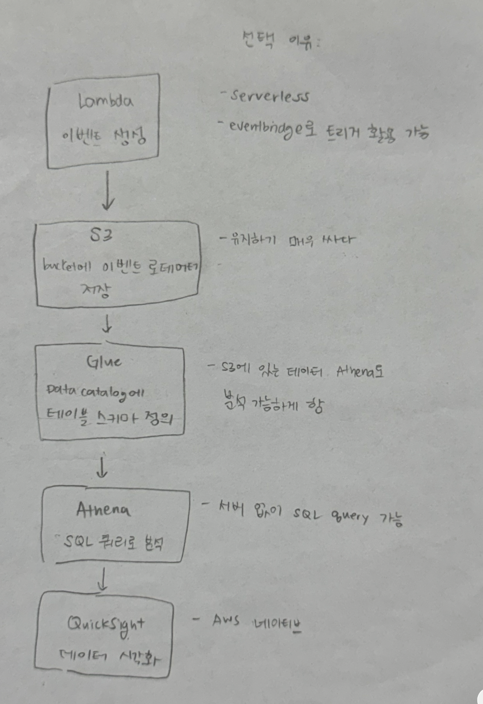

# 실행 방법

### 1. 환경변수 설정

```bash
cp .env.example .env # Windows 라면 cp 대신 copy

# .env 파일을 열어서 DB_PASSWORD 설정
```

### 2. 로컬 Python 환경 설정

```bash
python -m venv venv
source venv/bin/activate # Windows 라면 venv\Scripts\activate
pip install -r requirements.txt
```

### 3. Docker로 이벤트 생성 + DB에 저장

```bash
docker compose up --build -d
docker compose logs app  # "DB에 100개의 이벤트 저장 완료!" 확인
```

### 4. 로컬에서 분석 실행

```bash
source venv/bin/activate # Windows 라면 venv\Scripts\activate
python analysis.py
```

### 5. output/ 폴더에서 차트 확인

```bash
open output/ # Mac
# Windows: start output (또는 explorer output)
# Linux: xdg-open output/
```

# 스키마 설명

테이블은 스파스 열을 활용한 와이드 테이블로 설계하였습니다. 각 이벤트 고유의 필드를 properties라는 JSON 타입의 열 한개에 넣어볼까도 고민 했지만, 과제 특성상 이벤트수가 적고 테이블이 크지 않아서 분석에 더 편리하도록 각 이벤트 고유 필드를 각각의 열로 설정해 타입을 유지하기로 결정했습니다. 하지만, 이벤트를 더 늘리게 된다면, 이벤트 하나 추가 될때마다 매번 테이블 스키마를 수정해야하고 테이블도 읽기 힘들게 커질테니, JSON 타입의 열을 사용하는 방식으로 수정해 나가는 것도 좋을 것이라고 판단됩니다.

# 구현하면서 고민한 점

### 이벤트

이벤트 타입은 총 세가지로, 페이지 조회, 구매, 에러로 설정하였습니다.
모든 이벤트는 발생한 시간, 유저의 아이디, 그리고 이벤트 타입을 공통적 필드로 가지고 있고, 그 외에 이벤트 고유의 필드는

- 페이지 조회: 조회된 페이지
- 구매: 구매한 수업명
- 에러: 일어난 에러의 코드

로 설정하였습니다. 그 이유는 이벤트별 이벤트를 이해하는데 필요한 정보가 다르기 때문입니다.

조회 가능한 페이지는 많은 사이트들이 가지고 있는 페이지들인 `home`, `about`, `careers` 페이지들과, 수업 페이지 10개를 임의로 설정해 두었습니다. 구매할 수 있는 제품들 또한 수업 10개 중 하나로 설정하였고, 에러 코드는 웹 사이트에서 자주 일어나는 클라이언트, 서버 에러 각각 네개씩 골라서 설정하였습니다. 샘플로 만드는 이벤트들이니, 실제 내용이 중요하다기 보다 구현하는 로직이 더 중요하다고 여겨져, 기본 웹 페이지의 모양을 갖춰 의미 있는 분석에 활용될 수 있도록 설계하려고 노력했습니다.

### 저장소

우선, 이벤트들을 제가 직접 설정하고 필드를 구성할 수 있는 과제 특성상 저장소의 구조를 확실하게 잡을 수 있어 관계형 데이터베이스 관리 시스템을 사용하고자 했습니다. 그중 MySQL을 선택한 이유는 Docker로 띄우기 편리하고 과제에서 요구하는 SQL 쿼리를 지원하기 때문입니다. 그리고 개인적으로 MySQL을 사용한 경험은 없고, PostgreSQL을 사용해 왔었는데, 같은 관계형 DB인 MySQL은 어떻게 다른지 직접 경험해보고 싶다는 점도 선택의 한 이유였습니다.

### 기타 고민

처음에는 pandas의 `.value_counts()` 함수를 사용하면 좋겠다고 판단하여 pandas를 불러왔지만, 과제에서 SQL 집계를 요구하여 분석 로직을 SQL 코드로 다시 작성하였습니다. 그 과정에서 pandas를 완전히 제거하지는 않고 시각화 용도로 남겨 두었습니다. pandas의 DataFrame과 Series는 matplotlib으로 바로 시각화하기 편리했기 때문입니다. 그런데 pandas는 mysql.connector를 공식적으로 지원 하지 않는다는 유저 워닝이 생기게 되었습니다. mysql.connector 를 사용하는 대신 SQLAlchemy를 활용하여 engine을 만들어 해결하는 방법이 있지만, 제가 다루는 간단한 쿼리는 문제 없이 작동하여, 우선은 현재 방식을 유지했습니다. 향후 더 복잡한 쿼리를 필요로 하게된다면 SQLAlchemy engine을 사용해 pandas가 공식 지원하는 connectable로 전환할 계획입니다.

# 선택 과제: B. AWS 기초 이해

### 1)



### 2)

우선 Lambda는 서버를 따로 활용하지 않고도 특정 코드를 작동 시킬 수 있는 서비스이기 때문에, 이 프로젝트에서 이벤트를 생성하기에 편리하다. Lambda function을 직접 부르거나, 트리거를 만들어 여러번 부르게 할 수 있다. S3는 파일 기반 저장소라 생성된 이벤트들의 로데이터를 저장하기에 편리하다. Glue의 기능중 하나인 data catalog을 활용해서 데이터 스키마를 직접 설정하여 S3에 있는 데이터를 Athena를 사용해 분석할 수 있도록 한다. (Glue가 이름에 걸맞게 연결고리 역할을 하는 셈이다.) Athena는 서버 없이 SQL 쿼리를 가능하게 하여 데이터를 의미 있는 인사이트로 바꿔준다. Athena로 얻어낸 결과물을 QuickSight을 활용하여 차트로 시각화 한다.

고민되는 부분은 QuickSight가 꽤 비싸다는 점이다. 다른 오픈소스 패키지를 도입해 또다른 Lambda function에서 활용하여 시각화하는 방법도 있다고 생각이 되는데, QuickSight가 AWS에 네이티브한 서비스이니 Athena 에서 이어서 사용하기 편리할 것이라고 판단되어 선택하게 되었다.
